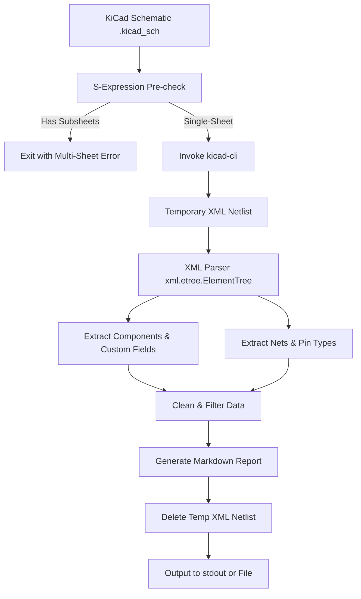

# KiCad Schematic Analyzer: Requirements Specification

This document details the functional, architectural, and formatting requirements for a Python script designed to parse KiCad schematic files (`.kicad_sch`) and extract metadata, component details, and net connectivity into a structured Markdown document. The generated Markdown is optimized for consumption by a Large Language Model (LLM) to perform an automated engineering review.

---

## 1. Objectives & Scope

- **Primary Goal:** Parse a `.kicad_sch` file and generate a token-efficient, highly readable Markdown report of the circuit design.
- **Consumer:** Large Language Model (LLM) tasked with identifying design flaws, missing protection circuitry, and component errors.
- **Constraints:**
  - Standard-library-only Python (no external `pip` dependencies).
  - Use `kicad-cli` to handle complex netlist and sheet resolution.
  - Target single-sheet designs initially, with detection/error handling for multi-sheet schematics.

---

## 2. System Architecture

The tool follows a multi-stage pipeline:



---

## 3. Functional Requirements

### 3.1 Command-Line Interface (CLI)
- **Usage:** The script must provide a clean CLI using `argparse`.
- **Help Option:** Running with `-h` or `--help` must display usage instructions.
- **Input Parameter:** The path to the `.kicad_sch` file is a required positional argument. If not provided, exit with a descriptive error message to `stderr` and a non-zero exit code.
- **Output Option:** 
  - By default, output the generated Markdown directly to `stdout`.
  - Include an optional flag, `-o` or `--output`, specifying a file path to write the Markdown output to.

### 3.2 Pre-Checks & Dependency Validation
- **kicad-cli Dependency:** The script must check if `kicad-cli` is accessible in the system path. If not found, output an error to `stderr` and exit.
- **Multi-Sheet Detection:** Before running `kicad-cli`, scan the raw `.kicad_sch` S-expression file. If any `(sheet ...)` definition is found at the root level:
  - Halt execution.
  - Exit with a non-zero code.
  - Print a specific error message directed at the LLM:
    > "Error: Multi-sheet schematic detected. Please request the maintainer to update this script to support hierarchical multi-sheet designs."

### 3.3 Netlist Extraction via KiCad-CLI
- The script must invoke `kicad-cli` as a subprocess to export the schematic netlist:
  ```bash
  kicad-cli sch export netlist --format kicadxml -o <temp_file>.xml <input_file>.kicad_sch
  ```
- All temporary files created during execution must be cleaned up in a `finally` block to ensure no leftovers remain on failure.

### 3.4 Data Extraction
Using Python's built-in `xml.etree.ElementTree`, the script must extract the following structures from the exported XML netlist:

1. **Components:**
   - Reference designator (`ref`).
   - Value (`value`).
   - Footprint (`footprint`).
   - Datasheet (`datasheet`).
   - Library Source Part (`libsource lib` and `part`).
   - Description (`description`).
   - **Custom Fields:** Look for any `<field>` elements:
     - Keep `MPN` or `Manufacturer Part Number` fields.
     - Keep any field whose name contains the string `JLCPCB` or `LCSC` (case-insensitive).
     - **Constraint:** Omit any custom fields that are empty or missing.

2. **Nets & Connectivity:**
   - Extract all `<net>` nodes.
   - For each net, map its name to all connected `<node>` definitions:
     - Connected component reference (`ref`).
     - Pin number (`pin`).
     - Pin function (`pinfunction`).
     - Electrical pin type (`pintype`).

3. **Unconnected / No-Connect Pins:**
   - Identify pins that are not associated with any net.
   - Identify pins explicitly configured with the `passive+no_connect` pintype.

4. **Power Rails:**
   - Classify a net as a power rail if:
     - It contains a connected pin with `pintype="power_in"` or `pintype="power_out"`.
     - The net name is associated with a power source (e.g., contains `+`, `-`, `VCC`, `VDD`, `GND`, `VSS`, `Power`).

---

## 4. Markdown Output Format Specification

The generated Markdown output must contain the following structured sections:

### 4.1 Metadata Summary
```markdown
# KiCad Schematic Design Report: [Schematic Filename]

- **Date:** [Extraction Timestamp]
- **KiCad Tool Version:** [Eeschema Version from XML]
- **Design Source:** [Source path]
```

### 4.2 Component Catalog
A clean list of all parts. Omit optional fields if they are missing or empty:
```markdown
## Component Catalog

- **[Ref]**
  - **Value:** `[Value]`
  - **Library Part:** `[Lib]:[Part]`
  - **Footprint:** `[Footprint]`
  - **Description:** [Description]
  - **Datasheet:** [Datasheet Link]
  - **MPN:** `[MPN Value]` *(Omit if missing)*
  - **LCSC / JLCPCB Part:** `[Part Number]` *(Omit if missing)*
```

### 4.3 Power Rails Audit
A quick-reference section highlighting components attached to power rails:
```markdown
## Power Rails Audit

### Net: [Power Net Name, e.g., GND]
- **[Ref]** - Pin [Pin Number] ([Pin Function] / [Pin Type])
- **U1** - Pin 11 (V-_11 / power_in)
```

### 4.4 Netlist / Connectivity
Every signal net and its connections, excluding nets already audited in the Power Rails section:
```markdown
## Connectivity Netlist

### Net: [Net Name, e.g., INPUT1]
- **[Ref]** - Pin [Pin Number] ([Pin Function] / [Pin Type])
- **J2** - Pin T (T / passive)
- **R1** - Pin 1 (1 / passive)
- **U1** - Pin 10 (+_10 / input)
```

### 4.5 Unconnected / No-Connect Pins
```markdown
## Unconnected & No-Connect Pins

- **[Ref]** - Pin [Pin Number] ([Pin Function] / [Pin Type])
```

---

## 5. Verification Plan

To verify correct implementation:
1. **Validation against `Buffered-Mult.kicad_sch`:** Ensure the script parses `Buffered-Mult.kicad_sch` successfully, outputs to both stdout and a file, and correctly maps the TL074 quad op-amps (`U1`, `U2`, `U3`) and connectors.
2. **Help Check:** Verify `python3 analyze_schematic.py --help` outputs description and arguments.
3. **No-Args Check:** Verify running without arguments exits with code `1` and outputs a usage warning.
4. **Multi-sheet check:** Create a mock `.kicad_sch` file with a `(sheet ...)` block, run the script against it, and verify that it aborts with the exact directed error message.
